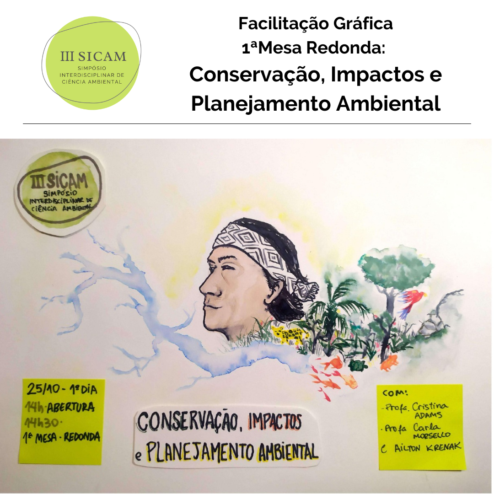
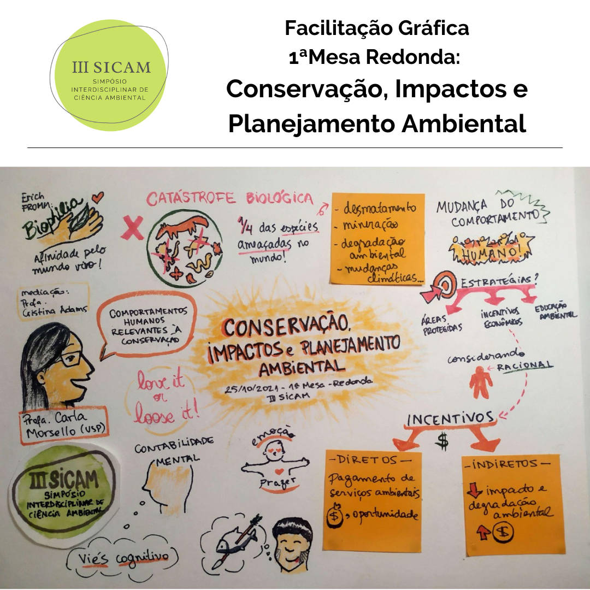
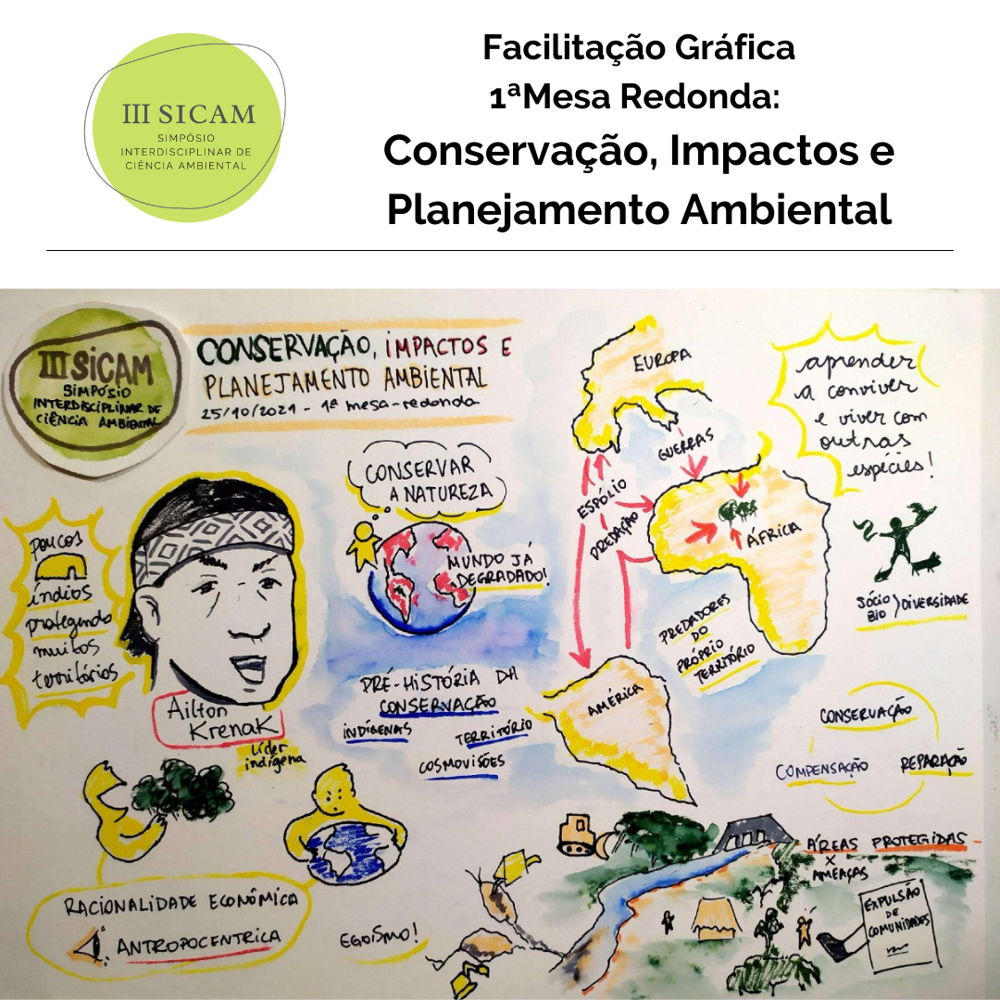

```{r setup, include=FALSE}
knitr::opts_chunk$set(echo = FALSE)
```

<link rel="stylesheet" href="https://cdn.jsdelivr.net/gh/jpswalsh/academicons@1/css/academicons.min.css">


## 25/10/2021 - Conservação, Impactos e Planejamento Ambiental 

Facilitação gráfica por [<i class="fab fa-instagram"></i> Renata Utsunomiya](https://www.instagram.com/mon_arte_pensamento_visual/).

```{r echo=FALSE, out.width="90%", fig.align='center'}





```


## 26/10/2021 - Governança, Políticas Ambientais e Sustentabilidade

Em breve

## 27/10/2021 - Mudanças Climáticas, Geotecnologias e Modelagem

Em breve
